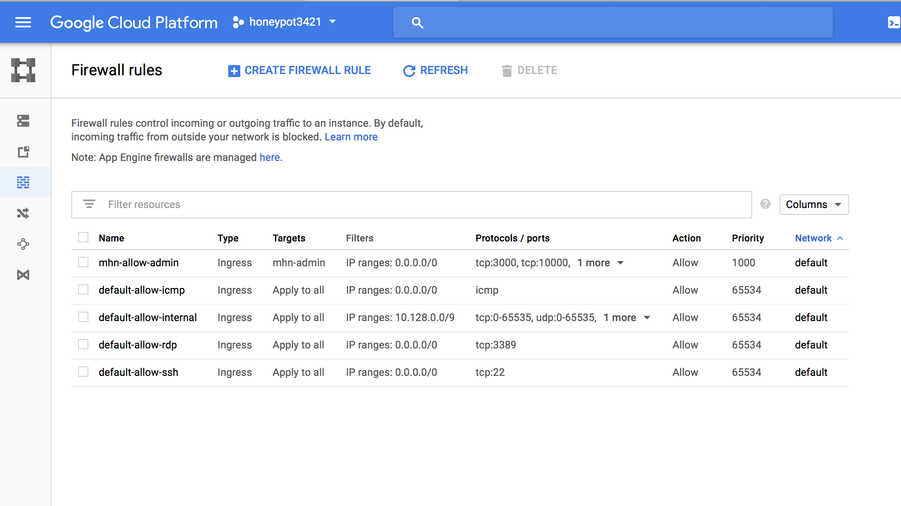
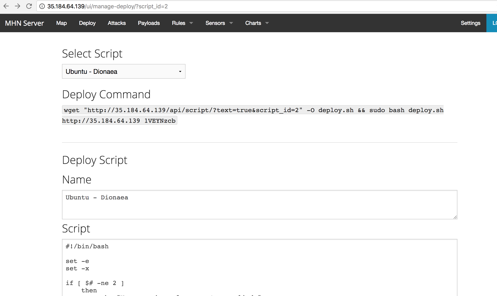
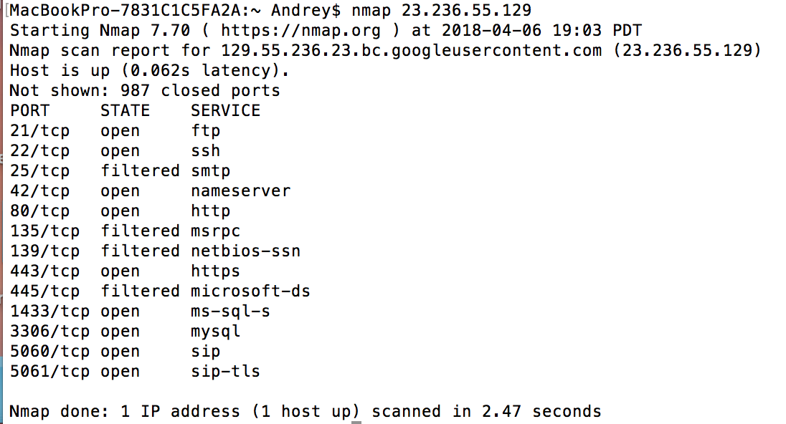
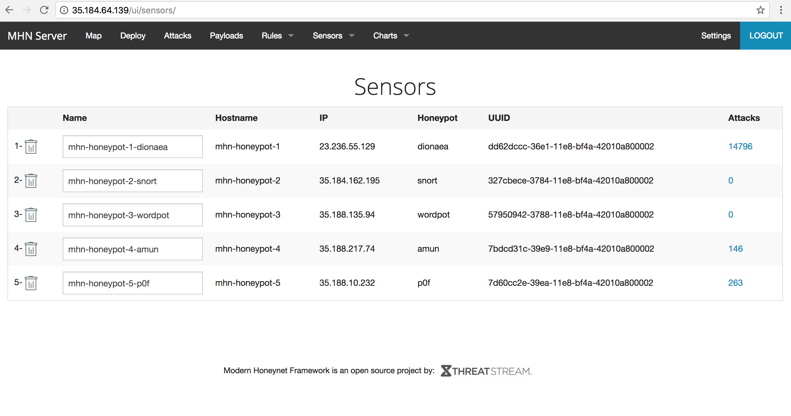
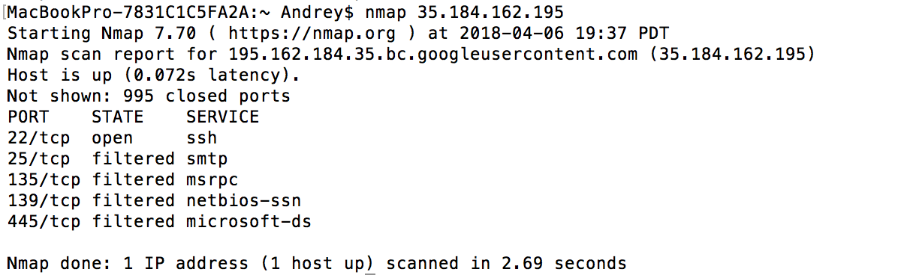
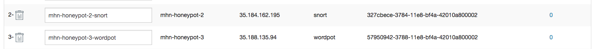
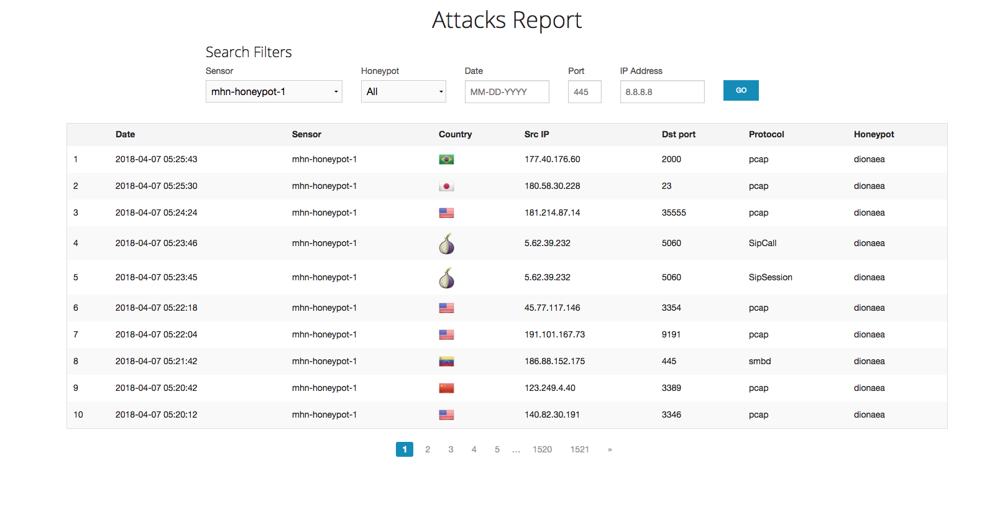
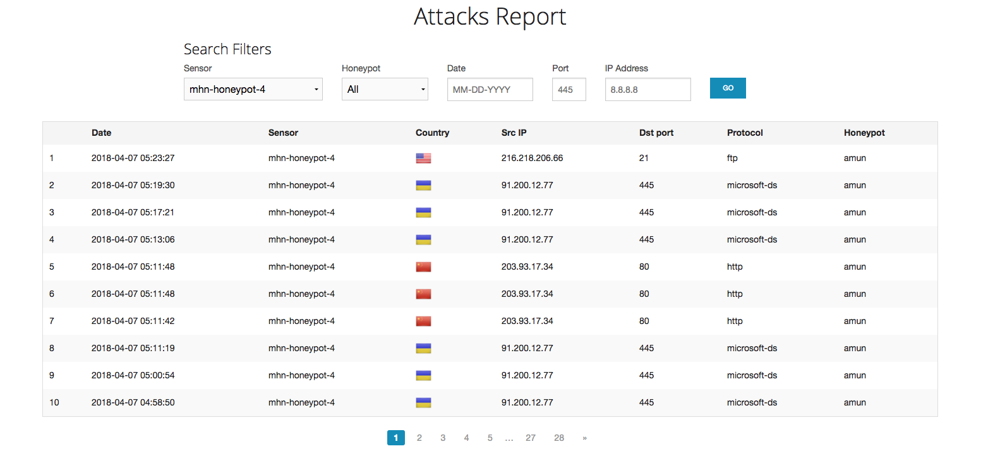
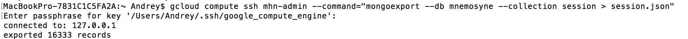

# Facebook Cybersecurity Course Project 9: Honeypot

## Objective: Setup a honeypot and provide a working demonstration of its features.

### 1. Overview & Setup | Which Honeypot(s) you deployed

* To deploy honeypots I've used Google Cloud. I've downloaded and installed Google Cloud Platform SDK so I was able to run ```gcloud``` from a command line.

* For the VM i've used Ubuntu 14.04 with following open ports: 80, 3000, 10000. I've created the following firewall rules with command
   ``` 
   $ gcloud beta compute firewall-rules create mhn-allow-admin --direction=INGRESS --priority=1000 --network=default --action=ALLOW -- rules=tcp:3000,tcp:10000 --source-ranges=0.0.0.0/0 --target-tags=mhn-admin
   ```
   Next step was to set up admin virtual machine:
   ```
   $ gcloud compute instances create "mhn-admin" --machine-type "f1-micro" --subnet "default" --maintenance-policy "MIGRATE"  --scopes "https://www.googleapis.com/auth/devstorage.read_only","https://www.googleapis.com/auth/logging.write","https://www.googleapis.com/auth/monitoring.write","https://www.googleapis.com/auth/servicecontrol","https://www.googleapis.com/auth/service.management.readonly","https://www.googleapis.com/auth/trace.append" --tags "mhn-admin","http-server","https-server" --image "ubuntu-1404-trusty-v20171010" --image-project "ubuntu-os-cloud" --boot-disk-size "10" --boot-disk-type "pd-standard" --boot-disk-device-name "mhn-admin"
   ```
   From the output we can notice the external ip address for access to the admin panel
   ```
   NAME         ZONE           MACHINE_TYPE  PREEMPTIBLE  INTERNAL_IP  EXTERNAL_IP    STATUS
   mhn-admin  us-central1-c  f1-micro                   10.128.0.6   35.184.64.139  RUNNING
   ```
* After the set-up was complete I've installed the MHN Admin application
   ```
   $ gcloud compute ssh mhn-admin
  ...
  $ sudo apt-get update
  $ sudo apt-get install git -y
  $ cd /opt
  $ sudo git clone https://github.com/RedolentSun/mhn.git
  $ cd mhn
  $ sudo ./install.sh
  ...
  $ exit
   ```
   During the installation I was asked multiple configuration questions, answers were either no, or default

* Next step was to create a honeypot VM itself, starting with firewall rules
   ```
   $ gcloud beta compute firewall-rules create mhn-allow-honeypot --direction=INGRESS --priority=1000 --network=default --action=ALLOW --rules=all --source-ranges=0.0.0.0/0 --target-tags=mhn-honeypot
   ```
   <kbd></kbd><br /> 
   and creating the instance:
   ```
   $ gcloud compute instances create "mhn-honeypot-1" --machine-type "f1-micro" --subnet "default" --maintenance-policy "MIGRATE"  --scopes "https://www.googleapis.com/auth/devstorage.read_only","https://www.googleapis.com/auth/logging.write","https://www.googleapis.com/auth/monitoring.write","https://www.googleapis.com/auth/servicecontrol","https://www.googleapis.com/auth/service.management.readonly","https://www.googleapis.com/auth/trace.append" --tags "mhn-honeypot","http-server" --image "ubuntu-1404-trusty-v20171010" --image-project "ubuntu-os-cloud" --boot-disk-size "10" --boot-disk-type "pd-standard" --boot-disk-device-name "mhn-honeypot-1"
   ```
   In the output we will get internal and externa IP addresses
   ```
   NAME            ZONE           MACHINE_TYPE  PREEMPTIBLE  INTERNAL_IP  EXTERNAL_IP    STATUS
   mhn-honeypot-1  us-central1-c  f1-micro                   10.128.0.3   23.236.55.129  RUNNING
   ```
   
* Install the Honepot application
   Enter the ssh mode for the created honeypot
   ```
   gcloud compute ssh mhn-honeypot-1
   ```
   Go to the admin panel using the ip address that I've noticed earlier ```35.184.64.139 ``` and clicked the Deploy button. From the drop down menu for my first Honeypot I've chose ```Ubuntu-Dionaea``` and copied the following deploy command to the ```mhn-honeypot-1``` ssh:
   ```
   wget "http://35.184.64.139/api/script/?text=true&script_id=2" -O deploy.sh && sudo bash deploy.sh http://35.184.64.139 1VEYNzcb
   ```
   <kbd></kbd><br /> 
* Attach the honeypot
   To test the attack on the honeypot i've used nmap command and IP address of honeypot-1:
   <kbd></kbd><br /> 
   As we can see there are 13 open ports on the honeypot and 987 closed ones
   
* To set up different types of honeypots I've repeated the last 3 steps except creating a firewall. I've replaced mhn-honeypot-1 with mhn-honeypot-2, mhn-honeypot-3 etc in the create instance command.
   When we go to the  ```mhn-admin``` admin panel using my ```35.184.64.139 ``` IP address and choose ```Sensors> View sensors``` we can see all deployed honeypots with details and the attack number
   
   <kbd></kbd><br /> 
   I've creted the following types of Honeypots:
     - Dionaea
     - Snort
     - Wordpot
     - Amun
     - p0f
     
### 2. Issues encountered
   Most of the honeypots we working normally, but for some reason ```Ubuntu-Wordpot``` and ```Ubuntu-Snort``` did not reflected any attacks in the admin panel, even though I've sucessfully used nmap attacks and WPscan myself
   <kbd></kbd><br /> 
   In the admin panel I still had <br /> 
   <kbd></kbd><br /> 
   Later I've noticed that there are actually some alerts in the .json file for Snort Honeypot, so maybe it's just the admin panel bag. <br />
   With the Wordpot there are no records in the .json file at all, even though the VM seems to be running normally and can be scanned by Nmap and WPScan

### 3. Summary of the data collected
   For several days period the the honeypots had the following number of attacks:
   
   | Honeypot | total attacks |
   | --- | --- |
   | Dionaea |  > 14000 |
   | Snort | 0 |
   | Wordpot | 0 |
   | Amun | 228 |
   | p0f | 296 |
   
   The zero number of attacks is probably a result of a system bug as described above in the Issue section
   
   Below screenshot shows the information for the Dionaea honeypot: 
   
   <kbd></kbd><br />
   
   The attacks are coming from different countries all over the world which is very fascinating and make you realize that Internat is a pretty dangerous place. There is a wide range of Dst ports that are being exploited and most common protocols of the attacks are:
   * smbd
   * pcap
   * mssqld
   Unfortunately, there was no any payloads registered for Dionaea
   
   Next is a screenshot for Amun Honeypot:
   
   <kbd></kbd><br />
   
   The other Honeypot which got my attention by having the most numbers of payload is Snort <br />
   <b>Payload</b> screenshot: 
   
   <kbd></kbd><br />
   
   Here we can see the different types of scans. The most popular are: <br />
   * ET SCAN SipCLI VOIP Scan
   * ET DROP Dshield Block Listed Source group 1
   * ET SCAN Suspicious inbound to MSSQL port 1433
   * ET CINS Active Threat Intelligence Poor Reputation IP TCP group 3
   * ET SCAN Suspicious inbound to MSSQL port 1433
   
   <b>Export: </b> I've used mongoexpert to export data from the honeypots using the following command:
   <kbd></kbd><br />
   
   The .json file contains the information about the attacks, which inculdes protocol, port, ip address, honeypot name, timestamp, source port and identifier (Dionaea example): 
   
   ```
   { "_id" : { "$oid" : "5ac40df9616a1e77b1380124" }, "protocol" : "pcap", "hpfeed_id" : { "$oid" : "5ac40df6616a1e77b1380123" }, "timestamp" : { "$date" : "2018-04-03T23:27:50.399+0000" }, "source_ip" : "77.72.82.92", "source_port" : 45355, "destination_port" : 21958, "identifier" : "dd62dccc-36e1-11e8-bf4a-42010a800002", "honeypot" : "dionaea" }
   ```
   There is  some additional information present for other honeypots with signature details of the scan methods:
   ```
   { "_id" : { "$oid" : "5ac40e0e616a1e77b138012e" }, "destination_ip" : "10.128.0.3", "protocol" : "TCP", "hpfeed_id" : { "$oid" : "5ac40e0c616a1e77b1380127" }, "timestamp" : { "$date" : "2018-04-03T23:28:12.080+0000" }, "source_ip" : "60.12.171.30", "snort" : { "priority" : 2, "header" : "1:2403384:39535", "classification" : 30, "signature" : "ET CINS Active Threat Intelligence Poor Reputation IP TCP group 43" }, "source_port" : 56929, "honeypot" : "snort", "identifier" : "d4809ba0-377f-11e8-bf4a-42010a800002", "sensor" : "d4809ba0-377f-11e8-bf4a-42010a800002", "destination_port" : 1433 }
   ```
   I was also trying different combinations to get more information using Mnemosyne and commands like --file, --hpfeed, --metadata, but the data was similar

